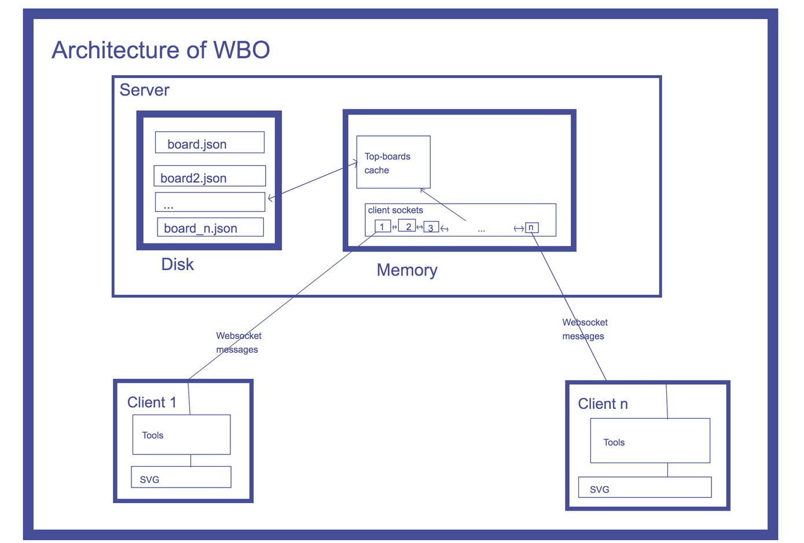

**lab4**

初步决定在两个题目中，选择做**在线白板**

# 1.实验目的
- 掌握Socket编程的基本方法
- 掌握客户/服务器的实现原理
- 利用Winsock API或者Java Socket API编制一个能部署在Internet上的共享白板系统

# 2.项目名称

**共享白板系统**

# 3. 实验内容

## 3.1 系统内容要求
1. 实现基于服务器转发的多点间的文字、作图等信息的实时同步共享。
2. 作图包括划线、矩形、圆形等。
3. 所有参与者均可发起共享或取消已有的共享。
4. 其他参与者要能及时展示出发起或取消的共享信息。

## 3.2 系统技术要求
1. 基于SOCKET编程实现
2. 传输层可采用TCP或UDP协议
3. 必须提供详细的应用协议设计
4. 清晰地展示系统功能和关系
5. 具有良好的可视化界面

# 4. 实现方式

不想去处理硬核图形API，还是用web技术去做吧

暂定原型用js写，不会现学就行

# 5. Milestone

准备分成两条线

## 5.1 白板绘制线
- [ ] 掌握如何在本地调用canvas，创造图形
- [ ] 掌握如何在本地接收参数（如鼠标按下移动），以直观形式绘制图形

## 5.2 Socket信息传输线
- [ ] 掌握如何通过Socket传递信息
- [ ] 掌握C/S架构下一对多的异步信息处理

## 5.3 在线白板
- [ ] 将上面两条线合并，用户发出绘制参数会发往服务端，服务端也会将其它用户的绘制参数返回给用户端，以显示它们绘制的图形
- [ ] （可选）本地端优化

# 6. 参考资料

（只是目前收集的部分）

1. 
2. 
3. 
